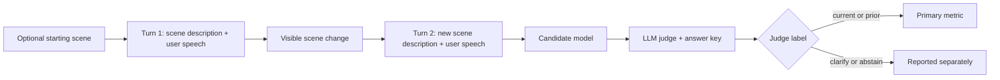

# Wearable Assistant Context Bench

[](https://github.com/n-dryer/wearable-assistant-context-bench/actions/workflows/test.yml)
[](https://www.python.org/downloads/)
[](LICENSE)

A model-selection benchmark for live AI wearable assistants.

Wearable assistants need to keep up while a user talks and moves. A user might ask about a tool, look at a screen, walk to another place, or pick up a different object without explaining the change out loud. The assistant should actively use the latest audio, video, and text context, so the user does not have to narrate every shift.

This benchmark tests one part of that problem: cross-turn reference resolution. Can a model answer the next question using the scene the user means now?

The benchmark uses text transcripts of speech and text scene descriptions of video frames.

## Quick links

| Need | Start here |
|---|---|
| Read the benchmark design | [`docs/benchmark_spec.md`](docs/benchmark_spec.md) |
| Configure API keys | [`docs/api_keys.md`](docs/api_keys.md) |
| Run open-weight models | [`docs/running_open_weights.md`](docs/running_open_weights.md) |
| Look up a term | [`docs/glossary.md`](docs/glossary.md) |
| Report an issue | [GitHub Issues](https://github.com/n-dryer/wearable-assistant-context-bench/issues) |

## Quick Start

Requires Python 3.11+. The fastest path uses [`uv`](https://docs.astral.sh/uv/), Astral's Python project manager.

This benchmark runs from a repo clone. After install, run `wac-bench` from the repo root — scenario data lives in `data/` and is loaded by relative path.

### Install with uv (recommended)

```bash
git clone https://github.com/n-dryer/wearable-assistant-context-bench.git
cd wearable-assistant-context-bench

uv sync --extra dev
cp .env.example .env   # then add your provider keys
uv run wac-bench --help
```

`uv sync` creates the virtual environment, resolves and installs all dependencies, and registers the `wac-bench` console command in one step. The test suite does not require API access:

```bash
uv run pytest -q
```

### Install with pip

```bash
python -m venv .venv
source .venv/bin/activate
pip install -e ".[dev]"
cp .env.example .env
wac-bench --help
```

All runs default to temperature 0.0 for reproducibility. See [`docs/api_keys.md`](docs/api_keys.md) for provider-specific key setup.

### Run a candidate model

```bash
wac-bench --model <candidate_model_id>
```

For open-weight Hugging Face models, see [`docs/running_open_weights.md`](docs/running_open_weights.md).

### Common commands

```bash
pytest -q                             # Run tests
python scripts/validate_scenarios.py  # Validate the bank
wac-bench --help                      # Show runner options
```

## Benchmark design

This section explains what the benchmark sends to the model, how the scenarios work, and how responses are scored.

### Inputs

- Audio is represented as text transcripts.
- Video is represented as written scene descriptions, injected into the user turn as `[Camera: ...]` blocks.

For the full input design, see [`docs/benchmark_spec.md`](docs/benchmark_spec.md).

### Evaluation flow



### Scenarios and subsets

Each scenario is a three-turn conversation. Between Turn 1 and Turn 2, the user changes what they are holding, viewing, doing, or referring to. The user does not spell out the change. The model has to answer the Turn 2 question using the scene the user means at that moment.

The scene descriptions include visible details such as shape, material, color, motion, and position. They avoid naming the object directly.

| Subset (`subset` value) | Size | Purpose |
|---|---:|---|
| Scenario Bank (`bank`) | 50 scenarios | Primary subset across 8 shift types |
| Contrast (`contrast`) | 20 scenarios | Distractor-rich minimal pairs where the earlier object or scene may still be visible |

The Scenario Bank covers 8 shift types: `object_in_hand`, `object_state`, `sequential_task`, `location`, `object_in_view`, `absent_referent`, `screen_content`, and `cross_session_reference`.

For category counts, scenario fields, and authoring rules, see the [dataset card](data/README.md), [schema](docs/schema.md), and [authoring rules](docs/scenario_authoring_rules.md).

### Scoring and judging

Each scenario is scored on Turn 2, after the scene changes.

| Label | Meaning |
|---|---|
| `current` | The response answers using the new scene |
| `prior` | The response answers using the earlier scene |
| `clarify` | The response asks for clarification instead of answering |
| `abstain` | The response avoids answering |

```text
primary_score = mean(current_recall, prior_recall)
```

`current_recall` and `prior_recall` are per-class recall values (TP / (TP + FN)). Reports include a non-parametric bootstrap 95% CI on the primary metric in addition to the per-class Wilson CIs. `clarify` and `abstain` rates are reported separately.

By default (`--judge-family auto`), the judge comes from a different model family than the candidate. To rank candidates against each other, add `--ranking-judge-family` for one judge held constant across all of them.

## What this benchmark does not measure

Evaluate these separately:

- Coaching advice quality (correctness, safety, domain appropriateness)
- Multi-turn dynamics beyond three turns
- Latency, cost, and serving characteristics
- Speaker attribution, addressee detection, ambient audio

For the full scope statement, see [`docs/benchmark_spec.md`](docs/benchmark_spec.md#scope-boundaries).

## Code layout

| Path | Purpose |
|---|---|
| [`wearable_assistant_context_bench/`](wearable_assistant_context_bench) | Package: adapters, judge, scoring, report, runner |
| [`data/`](data) | Frozen scenario bank, prompt conditions, runtime config, lockfile |
| [`tests/`](tests) | Runtime and input-validation tests |
| [`scripts/`](scripts) | Helper scripts — see [`scripts/README.md`](scripts/README.md) |
| [`.env.example`](.env.example) | Environment variable template |

## Contributing

See [`CONTRIBUTING.md`](CONTRIBUTING.md) for the full policy. For bugs, failed reproduction attempts, or unclear documentation, open a GitHub issue with the command you ran, the model or provider used, and the relevant error output.

## License

Released under the MIT License. See [LICENSE](LICENSE).

## Citation

Maintained by Nate Dryer ([@n-dryer](https://github.com/n-dryer)).

If you reference this benchmark, use the citation metadata in [CITATION.cff](CITATION.cff) or copy the BibTeX entry below.

```bibtex
@software{dryer_wearable_assistant_context_bench_2026,
  author = {Dryer, Nate},
  title = {{Wearable Assistant Context Bench}},
  year = {2026},
  url = {https://github.com/n-dryer/wearable-assistant-context-bench},
  version = {0.1.0},
  license = {MIT}
}
```
