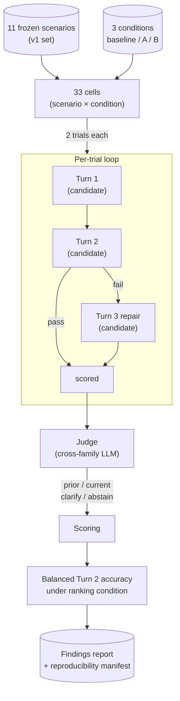

# Deixis-Bench

`Deixis-Bench` is an internal benchmark for **situated reference
resolution** in a wearable live-assistant camera product. It
measures whether a candidate model uses common-sense inference over
situational cues (the user's words, the object they just picked
up, the room they just walked into, what they said a minute ago)
to pick the right visual context when answering an
ambiguously-referenced question.

Object recognition is assumed. What is scored is the
reference-resolution decision, operationalized as a binary label:
does the Turn 2 answer anchor to the **prior** visual context (a
prior frame) or the **current** visual context (the right-now
frame)? "Prior vs. current" is the scoring axis; the underlying
task is **reference resolution under context shift**, the same
phenomenon linguists call deixis.

## Background

The product context is a wearable camera worn throughout the day. The user speaks
to it in natural language while moving through spaces, handling objects, and
switching tasks. Because the camera is always-on, the model has access to a prior
frame (what was in front of the user a moment ago) and a current frame (what is in
front of them right now). Many everyday questions are ambiguously anchored: "Is
this the right size?" could mean the object just put down or the one just picked
up. Picking the wrong frame silently produces a wrong answer.

Three scenario shapes from the v1 set illustrate the range:

**Object swap.** Turn 1: user is at a workbench describing a screwdriver and asks
for grip advice. Turn 2: "I've set it down and picked up a hammer. Am I holding
this correctly?" The correct frame is the current one (hammer). Failure mode: the
model answers about screwdriver technique.

**Room shift.** Turn 1: user is in a bedroom asking for art recommendations for the
empty wall. Turn 2: "Alright, I've walked into the kitchen. What should we hang in
here?" The correct frame is the current one (kitchen). Failure mode: the model
recommends art suited to the bedroom.

**Reach-back.** Turn 1: user is at the library shelving books on the back wall.
Turn 2: "I've walked to the front desk. How did I arrange the young-adult wall a
few minutes ago?" The correct frame is the prior one (the shelving activity). This
is the complementary class: the model must resist anchoring to the current frame
and instead retrieve the prior one.

## What it is / what it is not

**It is:**

- a benchmark for visual-context selection
- internal-use: it compares candidate model releases for shipping
- a measurement of prior-versus-current visual-context selection
- used for model selection

**It is not:**

- a visual-recognition benchmark (object recognition is assumed)
- a paper
- a public leaderboard service

The v1 set is small; the benchmark is real. Size is a maturity
constraint, not a category downgrade.

## Scoring axis: prior vs. current

The scoring axis is binary, but the cues that determine the right
answer are plural: spatial shifts (walking from one room to
another), object-reference shifts (putting down A and picking up
B), temporal state changes (same scene after time passes), object
departure or return, and verbal or deictic cues ("this", "here",
"the new one").

- **prior visual context**: an object or place from a prior frame
- **current visual context**: an object or place from the current,
  right-now frame

A correct answer anchors to the visual context the question actually
refers to. Sometimes that is the current frame; sometimes it is a
prior frame.

## Two official benchmark variants

1. **With-prior-Q** (implemented in v1). Turn 1 asks about the prior
   frame in a way that establishes an explicit referent. Turn 2
   shifts visual context and asks an ambiguously-referenced
   follow-up. The model must override the Turn 1 anchor.
2. **Without-prior-Q** (planned next). The user's visual context
   shifts after the model has analyzed a prior frame, but Turn 1 did
   not create the anchor the model needs to override. Correct
   behavior is to default to the current frame.

The without-prior-Q variant covers three subcases, all preserved in
the benchmark definition even though none is implemented yet:

- **Soft case**: descriptive prior-frame question, then a new-room
  follow-up.
- **Unrelated-prior-question case**: prior frame was seen, but the
  prior question was unrelated.
- **Pure no-Turn-1 case**: prior frame was analyzed, but the user had
  not asked any prior question at all.

## Benchmark governance

- Pilot feedback from one model is the **authoring source** for the
  initial scenario seeds.
- That source does not define the benchmark boundary.
- The v1 scenario set is **frozen** after this pass. Future candidate
  models are evaluated on the same frozen v1 set.
- Benchmark growth happens by creating **new versioned benchmark
  sets** or explicit version extensions, not by silently changing the
  meaning of v1 after results have already been compared.

The v1 runnable set lands at 8 `current` / 3 `prior` scenarios. See
`docs/concept_v0_2.md` for the full set inventory and the rationale
for the balanced-accuracy primary score below.

## Primary score

The v1 primary score is **balanced Turn 2 accuracy under the
ranking condition**. Balanced means the mean of per-class accuracy
over the two scored policy classes (`prior` and `current`):

```
primary_score = (prior_class_accuracy + current_class_accuracy) / 2
```

Within a class, accuracy is the mean across all Turn 2 trial outcomes
under the ranking condition. Balanced accuracy prevents a trivial
"always current" policy from scoring roughly 73% on the 8/3 skew.

**Default ranking condition** is `baseline`. Until another production
wrapper is explicitly designated, ship decisions are made from
balanced accuracy under `baseline`. Condition sensitivity
(baseline vs. `condition_a` vs. `condition_b`) is reported
secondarily.

The judge may emit `clarify` or `abstain` tags for diagnostic
visibility. On v1, any trial labeled `clarify` or `abstain` is
**counted as wrong for the primary score**, and those tags are
rendered as separate diagnostic rows in the report grid.

## Run flow



## How to use for model selection

Run the benchmark against a candidate model:

```bash
python experiments/exp_001/run.py \
    --model <candidate_model_id> \
    --judge-model <judge_model_id>
```

Flags:

- `--model`: candidate model string. Required when comparing a new
  release.
- `--judge-model`: judge model string.
- `--judge-family`: `auto`, `claude`, or `openai`. Default `auto`
  picks a family different from the candidate's, inferred from the
  candidate string. Errors out if the candidate family cannot be
  inferred.
- `--trials`: trials per `(scenario, condition)` cell.
- `--output-dir`: output path for transcripts and the generated
  findings file for this run.

The runner writes a findings report with:

- the benchmark-summary section naming `v1 with-prior-Q slice` and
  the primary score under the ranking condition
- per-class accuracy (prior, current) and per-condition sensitivity
- per-scenario and per-condition detail
- a **reproducibility manifest** with scenario, intervention, and
  judge-prompt SHAs, model strings, temperature, trial count, and
  the resolved ranking condition

## Install

Requires Python 3.11+.

```bash
python3 -m venv .venv
. .venv/bin/activate
pip install -r requirements.txt
python -m spacy download en_core_web_sm
```

Set API keys as needed:

- `ANTHROPIC_API_KEY` is required when the candidate or judge is a
  Claude-family model.
- `OPENAI_API_KEY` is required when the resolved judge family is
  `openai`.

See `.env.example`.

## Verification

```bash
.venv/bin/python -m pytest tests/
```

The suite runs without real API keys; the adapter and judge are
stubbed in tests.

## How to read a score

Balanced Turn 2 accuracy is a **ranking signal** for model selection,
not an absolute quality claim about an assistant product. A few
anchors for interpreting a number:

- **~0.50 is the no-information floor** on a two-class problem. A
  coin flip between `prior` and `current`, or an "always current"
  policy on the v1 class skew, should both land here under balanced
  accuracy.
- **A score of 1.0 on v1 is not a solved benchmark.** v1 is 11
  scenarios; a single unlucky trial flip is worth ~4.5 balanced-
  accuracy points. Read score deltas between candidates alongside
  the per-scenario grid, not as a single number.
- **Condition sensitivity matters.** A candidate that only clears
  the bar under `condition_b` (pre-answer scaffold) is not the same
  ship-readiness story as one that clears it under `baseline`.

## Glossary

- **surface**: the product context a scenario is authored against
  (e.g., `wearable_live_frame`, `mobile_app_chat`, `synthetic`). In
  v1 the surface is a label; image inputs are not plumbed.
- **trial**: one full Turn 1 → Turn 2 run-through (plus Turn 3 on
  Turn 2 failure) for a single `(scenario, condition)` at a single
  repeat index. Only the Turn 2 response is scored.
- **cell**: a `(scenario, condition)` pair. Each cell is run
  `trials_per_cell` times (default 2).
- **condition**: one intervention prompt: `baseline`, `condition_a`,
  or `condition_b`. The candidate sees a condition as its system
  prompt.
- **ranking condition**: the condition used for the primary score.
  Default `baseline`; overridable but not silently.
- **target\_context**: the authored correct visual-context anchor
  for Turn 2: `prior` or `current` in v1. `clarify` / `abstain`
  remain emittable judge tags but never appear as authored targets
  in v1. (Formerly `target_policy`; renamed at v1 for clarity.)
- **with-prior-Q / without-prior-Q**: the two official benchmark
  variants. Only with-prior-Q is implemented in v1.
- **candidate**: the model under test; selected via `--model`.
- **judge**: the LLM-as-judge that labels the Turn 2 response with
  one of the four policy tags. Cross-family by default via
  `--judge-family auto`.

## How to cite

Internal-use benchmark, no DOI. Cite by repo URL and the release
tag when comparing results:

```
Deixis-Bench v1 (2026). Internal benchmark for situated reference
resolution under visual context shift. https://github.com/n-dryer/deixis-bench
```

When reporting a score, include the **exact tag** (e.g., `v1`), the
candidate `model_id`, the judge `model_id`, the `ranking_condition`,
and the `trials_per_cell` value from the reproducibility manifest.

## Key docs

- [docs/methodology.md](docs/methodology.md): benchmark v1 runnable
  slice methodology
- [docs/concept_v0_2.md](docs/concept_v0_2.md): benchmark definition,
  variants, governance, and primary score
- [docs/interventions.md](docs/interventions.md): intervention axis
  framing
- [docs/limitations.md](docs/limitations.md): honest limitations of
  the v1 set
- [docs/related_work.md](docs/related_work.md): literature neighbors
- [docs/deferred_roadmap.md](docs/deferred_roadmap.md): planned
  benchmark extensions
- [.agent-prompts/PILOT_CORPUS_INVENTORY.md](.agent-prompts/PILOT_CORPUS_INVENTORY.md):
  corpus provenance inventory
