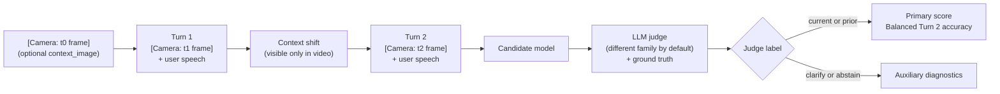

# Wearable Assistant Context Benchmark

[](https://github.com/n-dryer/wearable-assistant-context-bench/actions/workflows/test.yml)
[](https://www.python.org/downloads/)
[](LICENSE)

[](https://n-dryer.github.io/wearable-assistant-context-bench/)

A benchmark for comparing models for live AI wearable assistants.

These assistants process multimodal inputs during ongoing conversations. This benchmark simulates this using text proxies: transcripts for audio and scene descriptions for video frames. The user may be talking about one object, place, screen, or task, then shift to something else without saying exactly what changed. In a wearable setting, the user should not have to keep explaining what they are holding, looking at, or doing.

This benchmark tests one part of that product problem: whether the model can follow the user’s reference after the visible scene changes. Specifically, it tests cross-turn multimodal reference resolution. The model should answer based on the object, place, screen, or task the user means now, not the one from the earlier turn.

Use the score as one signal when comparing models for wearable assistant products. It does not test the full device experience.

## Quick links

| Need | Start here |
|---|---|
| View published results | [Live results page](https://n-dryer.github.io/wearable-assistant-context-bench/) |
| View the one-page overview | [Live overview page](https://n-dryer.github.io/wearable-assistant-context-bench/) |
| Interpret scores | [`docs/benchmark_notes.md`](docs/benchmark_notes.md) |
| Reproduce v1 runs | [`benchmark/v1/dataset_card.md`](benchmark/v1/dataset_card.md#reproducing-the-v1-runs) |
| Understand the benchmark design | [`docs/benchmark_spec.md`](docs/benchmark_spec.md) |
| Configure API keys | [`docs/api_keys.md`](docs/api_keys.md) |
| Run open-weight models | [`docs/running_open_weights.md`](docs/running_open_weights.md) |
| Report an issue | [GitHub Issues](https://github.com/n-dryer/wearable-assistant-context-bench/issues) |

## Published results

v1 includes six published runs. Five use the 50-scenario Scenario Bank. The `adversarial` run uses a separate 20-scenario pack with more distractors. **The primary score evaluates Balanced Turn 2 accuracy (current vs. prior situation).** The strongest published Scenario Bank result is `baseline-alt` at **77.7%** primary score. The `ablation-no-camera` run drops to **14.4%**, showing that performance is highly sensitive to removing the visual context channel.

| Run | Candidate | Judge | Primary score (95% CI) |
|---|---|---|---|
| **baseline** | `gemini-2.5-flash-lite` | `gemini-2.5-flash-lite` (same-family) | **60.6%** (54.1&ndash;67.1) |
| **baseline-alt** | `gemini-2.5-flash` | `gemini-2.5-flash-lite` (same-family) | **77.7%** (71.3&ndash;84.0) |
| **ablation-no-camera** | `gemini-2.5-flash-lite`, `--no-camera` | `gemini-2.5-flash-lite` | **14.4%** (9.1&ndash;19.7) |
| **baseline-qwen-cross-family** | `dashscope-intl/qwen3-vl-plus` | `gemini-2.5-flash-lite` (cross-family) | **54.2%** (50.7&ndash;57.7) |
| **baseline-deictic-repair** | `gemini-2.5-flash-lite`, `--repair-style deictic` | `gemini-2.5-flash-lite` | **60.6%** (54.1&ndash;67.1) |
| **adversarial** | `gemini-2.5-flash-lite` (OpenRouter) | `gpt-4o-mini` (cross-family); `claude-haiku-4.5` ranking judge | **67.3%** (55.5&ndash;79.1) |

More detail:
- How often models answer from the new scene instead of the earlier one: [`benchmark/v1/dataset_card.md`](benchmark/v1/dataset_card.md#per-class-accuracy)
- How to read the scores: [`docs/benchmark_notes.md`](docs/benchmark_notes.md)
- Commands for reproducing each published run: [`benchmark/v1/dataset_card.md`](benchmark/v1/dataset_card.md#reproducing-the-v1-runs)

## Quickstart

Requires Python 3.11+. We recommend using [`uv`](https://docs.astral.sh/uv/) for rapid dependency and environment management.

### Install and verify
```bash
git clone https://github.com/n-dryer/wearable-assistant-context-bench.git
cd wearable-assistant-context-bench

# Modern environment setup via uv
uv venv
source .venv/bin/activate
uv pip install -e .

# Run tests
pytest tests/ -q
```
*(Note: If you prefer standard pip, run `./scripts/setup.sh` instead of the `uv` commands).*
The test suite does not require API access.

### Configure API keys
Copy `.env.example` to `.env`:
```bash
cp .env.example .env
```
Provider-specific key details: `docs/api_keys.md`.

### Run a candidate model
```bash
python -m benchmark.v1.run --model <candidate_model_id>
```
Published reproduction commands are listed in `benchmark/v1/dataset_card.md`.
Open-weight Hugging Face candidates: `docs/running_open_weights.md`.

### Common commands
```bash
# Run tests
python -m pytest tests/ -q

# Validate scenarios
python scripts/validate_scenarios.py

# Show runner options
python -m benchmark.v1.run --help
```

## Benchmark overview
This section summarizes the benchmark mechanics: how scenarios are built, what the model sees, and how responses are scored.

### Evaluation flow


### Scenario design
Each scenario is a three-turn conversation. The user's situation changes between Turn 1 and Turn 2, but only the video channel shows the change. The user does not announce the shift. The assistant must answer the Turn 2 question using the new situation.
Video frames are injected as `[Camera: ...]` blocks carrying scene descriptions: shape, material, color, motion, and position. They do not include the object name.

### Modality
- Audio is represented as text transcripts, not raw audio.
- Video is represented as scene descriptions, not raw video.

Benchmark design: `docs/benchmark_spec.md`.
Out of scope: `docs/benchmark_notes.md`.

### Scenarios

| Pack | Size | Purpose | Status |
|---|---|---|---|
| Scenario Bank | 50 scenarios | Main v1 benchmark across 8 shift-type categories | Published |
| Adversarial | 20 scenarios | Distractor-rich stress pack | Published |
| Hard candidates | 15 scenarios | Ceiling-test candidates for frontier models | Wired via `--pack hard`; no published run yet |

The Scenario Bank covers 8 shift-type categories: `object_in_hand`, `object_state`, `sequential_task`, `location`, `object_in_view`, `absent_referent`, `screen_content`, and `pre_conversation_recall`.
For category counts, scenario fields, and authoring rules, see the dataset card, schema, and authoring rules.

### Scoring and judging
Each scenario is evaluated on Turn 2, after the user's situation has changed.

| Label | Meaning |
|---|---|
| `current` | The response answers using the new situation |
| `prior` | The response answers using the earlier situation |
| `clarify` | The response asks for clarification instead of answering |
| `abstain` | The response avoids answering |

The primary score focuses on distinguishing answers based on the new situation from answers based on the earlier situation. `clarify` and `abstain` are reported as auxiliary diagnostics.

The primary score is Balanced Turn 2 accuracy:
`primary_score = mean(current_accuracy, prior_accuracy)`

By default (`--judge-family auto`), the judge comes from a different model family than the candidate to reduce same-family self-grading risk. To rank candidates directly against each other, add `--ranking-judge-family` for one judge held constant across all of them.
Full rationale: `docs/decisions.md`.

## Code layout

| Path | Purpose |
|---|---|
| `benchmark/v1` | Scenario bank, runner, and run outputs |
| `core` | Model adapters, judge, scoring, and report generation |
| `tests` | Runtime and input-validation tests |
| `scripts/validate_scenarios.py` | Scenario-bank validator |
| `.env.example` | Environment variable template for provider API keys |

## Contributing and support
Edits to scenario text, answer keys, prompt text, or scoring semantics are out of scope once the v1.0 release tag is created.
Bug fixes, new model adapters, documentation fixes, and reproducibility improvements are welcome through issues and pull requests.
For bugs, failed reproduction attempts, or unclear documentation, open a GitHub issue with the command you ran, the model or provider used, and the relevant error output.
See `CONTRIBUTING.md` for the full policy.

## Maintainer
Nate Dryer (@n-dryer).

## License
Released under the MIT License. See [LICENSE](LICENSE).

## Citation
If you reference this benchmark, please use the following BibTeX citation:
```bibtex
@misc{dryer2026wearable,
  author = {Dryer, Nate},
  title = {Wearable Assistant Context Benchmark},
  year = {2026},
  publisher = {GitHub},
  journal = {GitHub repository},
  howpublished = {\url{https://github.com/n-dryer/wearable-assistant-context-bench}}
}
```
