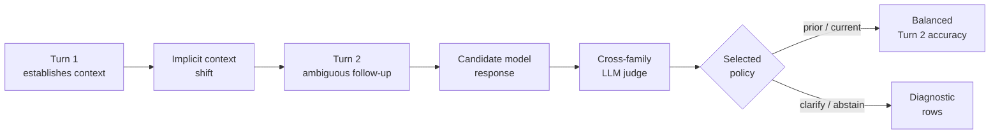

# Wearable Assistant Context Benchmark

[](https://github.com/n-dryer/wearable-assistant-context-bench/actions/workflows/test.yml)
[](https://www.python.org/downloads/)
[](LICENSE)

**A benchmark for implicit context tracking in wearable multimodal assistants.**

## Why this exists

This benchmark was built to support one practical decision: when a new
model release lands, does it replace the current model in the wearable
multimodal assistant?

In real use, the assistant has to infer what the user means from the
situational cues available in the interaction. Users say "this," "in
here," or "am I holding this correctly." The reference is ambiguous,
the way real speech is ambiguous. When the model makes the wrong
inference, it answers confidently about the wrong thing. The user has
to correct it, adding interaction cost each time it happens.

This benchmark was needed because one-off examples can't fairly compare
two models. Each model ends up tested on different examples, so the
comparison isn't on the same ground. This benchmark uses the same
scenarios every time, the same scoring rule, and keeps a record of
each run. For model selection on this benchmark, score deltas matter
more than absolute scores.

## What this benchmark measures

This benchmark measures how a wearable multimodal assistant handles
ambiguous user references when the user's context changes between
turns, such as where they are, what they are holding, or what is
around them. It focuses on a recurring interaction problem: the
assistant sometimes makes the wrong inference about what the user is
referring to and answers from the wrong context.

In v1, the formal task label is **reference-state selection under
implicit context shift**. In plain language, v1 checks whether the
answer follows the earlier context or the current context after the
user's context changes.

The scenarios come from a mix of pilot user feedback on a wearable
multimodal assistant at a stealth AI startup, direct hands-on testing
of real multimodal assistants and wearables, generalized cases based
on repeated patterns, and a small number of conceptual cases added to
cover important situations cleanly.

Although the benchmark was developed around a wearable multimodal
assistant, it can also apply to other multimodal assistant devices.
The device does not need to be worn, but it does need to be on or near
the user, support live multimodal input such as audio and video, and
respond through audio and/or text. It also needs to stay aimed at or
focused on the activity, object, place, or scene relevant to the
user's task or question.

Example: Turn 1 asks about a screwdriver. Turn 2 asks, "am I holding
this correctly?" after the user has picked up a hammer. The benchmark
checks whether the answer follows the hammer in hand now or the
screwdriver from a moment ago.

See [docs/benchmark_spec.md](docs/benchmark_spec.md) for the full
spec and [docs/benchmark_card.html](docs/benchmark_card.html) for the
one-page summary. See [docs/benchmark_notes.md](docs/benchmark_notes.md)
for fuller context on score interpretation, limitations, and benchmark
construction.

## Who this is for

This benchmark is primarily useful to applied ML and evaluation
engineers, along with product and engineering teams working on
wearable multimodal assistants and related multimodal assistant
devices.

In v1, this benchmark measures one concrete thing: whether the
assistant can figure out what the user is referencing when the user's
context changes between turns and their words are ambiguous. v1 is
small, frozen, inspectable, and reproducible. It is scoped to one
narrow model-selection question and released publicly for inspection.

## What v1 includes

- **11 frozen scenarios**
- **3 prompt conditions**: `baseline`, `condition_a`, `condition_b`
- **2 trials per (scenario, condition) cell** by default
- **Turn 2 scoring only**
- **Balanced Turn 2 accuracy** as the primary ranking metric
- **Cross-family LLM judge** by default through `--judge-family auto`
- **Reproducibility manifest** emitted with each run

## What this benchmark does not measure

- Object recognition accuracy. Object identity is assumed; the
  benchmark scores the context-selection decision, not whether the
  model identifies what is in front of it.
- General assistant quality, latency, cost, instruction following,
  safety, or refusal calibration. v1 is scoped to one capability.
- Long-horizon memory across sessions. v1 covers within-session shifts
  across two conversational turns.
- Real device telemetry. Scenarios are text proxies for
  visual-context shifts, not on-device captures.

## How it works



Each scenario runs across three prompt conditions and two trials per
cell at temperature 0. Only Turn 2 is scored. Turn 3 fires on Turn 2
failure as a templated repair anchor that feeds the simulated repair
rate.

## Repository layout

- [docs/benchmark_spec.md](docs/benchmark_spec.md): benchmark spec
- [docs/benchmark_card.html](docs/benchmark_card.html): one-page benchmark card
- [benchmark/v1](benchmark/v1): v1 inputs and runner
- [core](core): adapters, judge, scoring, report generation
- [tests](tests): verification for runtime behavior and benchmark inputs

## Install

Requires Python 3.11+.

```bash
python3 -m venv .venv
. .venv/bin/activate
pip install -r requirements.txt
python -m spacy download en_core_web_sm
```

Set API keys as needed:

- `ANTHROPIC_API_KEY` for Claude-family candidate or judge models
- `GEMINI_API_KEY` or `GOOGLE_API_KEY` for Gemini-family candidate or judge models

An example environment file is provided in [.env.example](.env.example).

## Run the benchmark

```bash
python -m benchmark.v1.run \
  --model <candidate_model_id> \
  --judge-model <judge_model_id>
```

Optional flags:

- `--judge-family auto|claude|gemini`
- `--trials <int>`
- `--output-dir <path>`

With no `--output-dir`, the runner writes transcripts, findings, and
the manifest to `benchmark/v1/runs/latest/`.

## Verify the repo

```bash
python -m pytest tests/ -q
```

The test suite runs without real API keys by stubbing candidate models
and the judge.

## How the judge works

A second model acts as the judge. For each follow-up answer, the
judge decides whether it refers to the earlier context (the **prior**
label) or the current context (the **current** label). By default the
judge runs in a different model family than the candidate to reduce
same-family bias.
`--judge-family auto` picks a different family automatically. Explicit
`claude` or `gemini` overrides are available if needed.

## How to read the primary score

The v1 primary score is **balanced Turn 2 accuracy under the ranking
condition**. Balanced means the mean of per-class accuracy across the
two scored classes, `prior` and `current`. v1 has more `current`
scenarios than `prior` ones, so balancing keeps that skew from
dominating the score.

The three prompt conditions are:

- **`baseline`**: a minimal system prompt. This is the main test and
  the condition that drives ranking.
- **`condition_a`**: adds an instruction telling the model to pick the
  right context before answering. Tests how stable the result
  is when the model is told directly to make this judgment.
- **`condition_b`**: requires the model to name which context it is
  using before it answers. Tests how stable the result is when the
  model has to say which context it is using in its output.

**Three guardrails when reading the score:**

- Use this score to compare models on the same benchmark, under the
  same condition. The delta between candidates matters more than the
  absolute number.
- The score does not tell you how good a model is overall. It measures
  one specific capability.
- The score does not tell you how good the product is. Many other
  things determine product quality.

**Simulated repair rate** is reported as a secondary metric. It stands
in for likely user correction cost after a wrong follow-up answer, and
is not part of the ranking. See [docs/benchmark_spec.md](docs/benchmark_spec.md)
for how it is computed.

## Results

v1 ships with one example baseline run under
`benchmark/v1/runs/v1-baseline/`. It uses `gemini-2.5-flash-lite` as
both candidate and judge — same-family, same-model — which inflates
the absolute score via self-preference. Treat it as a **shape demo**,
not a credible measurement. Cross-family baselines will land when an
ANTHROPIC_API_KEY is wired.

Future published runs will land under `benchmark/v1/runs/<run-label>/`.
See the manifest in each run directory for candidate model, judge
model, ranking condition, trial count, and git commit.

## Contributing

v1 is a frozen scenario set: scenario edits, condition changes, and
scoring changes are out of scope. Bug fixes, doc improvements, and
new candidate-model adapters are welcome. See
[CONTRIBUTING.md](CONTRIBUTING.md) for the full policy.

## License

Released under the MIT License. See [LICENSE](LICENSE).

## Citation

This benchmark is published in a public repo but was built for
internal use and does not have a DOI. Cite the repo URL and exact
release tag, then include the candidate model, judge model, ranking
condition, and trial count from the manifest.

## About this repo

This benchmark was built by a product manager supporting
model-selection decisions for a wearable multimodal assistant.
