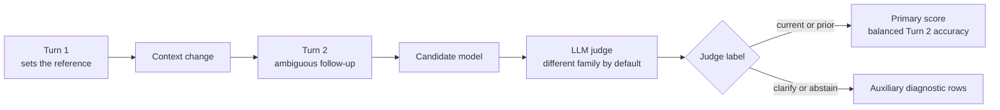

# Wearable Assistant Context Benchmark

[](https://github.com/n-dryer/wearable-assistant-context-bench/actions/workflows/test.yml)
[](https://www.python.org/downloads/)
[](LICENSE)

**A product benchmark for comparing models on cross-turn reference resolution under context change in a wearable multimodal assistant.**

## Why this exists

This benchmark was built to support a practical model-selection
decision for a live wearable assistant.

The product problem is simple:

- A user asks about the bedroom walls, walks into the kitchen, then
  asks about the walls again. The assistant answers as if the user is
  still in the bedroom.
- A user asks about a hammer, puts it down, picks up a screwdriver,
  then asks, "how do I use this?" The assistant answers about the
  hammer.

Users should not have to keep restating what they are looking at,
holding, or referring to. The assistant should infer the right
reference from the situational cues already present in the interaction.

This benchmark exists because one-off examples are not enough to make
that model-selection call. Every candidate needs to be tested on the
same scenarios, with the same prompt conditions, the same judge rules,
and a saved run record.

## What v1 currently measures

The current public v1 benchmark measures **cross-turn reference
resolution under context change**.

In plain language, it checks whether the assistant answers about the
right thing after the user's context changes, instead of forcing the
user to restate what they mean.

The benchmark was built from real user feedback and product testing on
wearable multimodal assistants, then expanded into a frozen scenario
bank for repeatable model comparison.

The current scenario bank covers reference changes such as:

- moving from one room to another
- swapping the object in hand
- switching to a new object in view
- switching screens
- asking about an earlier state after time passes
- recalling something that left the frame
- recalling a detail after an object is put away

Although the benchmark was developed around a wearable multimodal
assistant, it can also apply to related assistant devices on or near
the user if they support live multimodal interaction.

See [docs/benchmark_spec.md](docs/benchmark_spec.md) for the benchmark
contract, [docs/benchmark_notes.md](docs/benchmark_notes.md) for
interpretation guidance, [docs/benchmark_card.html](docs/benchmark_card.html)
for the one-page summary, and [docs/decisions.md](docs/decisions.md)
for the scoping rationale behind this release.

## What canonical v1 includes

- **101 frozen scenarios** in `benchmark/v1/scenarios.json`
- **3 prompt conditions**: `baseline`, `condition_a`, `condition_b`
- **2 trials per (scenario, condition) cell** by default
- **4 judge labels**: `current`, `prior`, `clarify`, `abstain`
- **Balanced Turn 2 accuracy** over `current` and `prior` as the
  primary ranking metric
- **Per-class pass rates** for all four labels as supporting context
- **Simulated repair rate** as a secondary product-facing metric
- **Cross-family judging by default** through `--judge-family auto`
- **Reproducibility manifest** emitted with each run

## What canonical v1 does not yet measure directly

- raw acoustic grounding from audio signals
- speaker attribution
- ambient audio cues
- addressee detection
- long-horizon memory across sessions
- overall assistant quality, latency, cost, or UX quality

Spoken user questions are already part of the cue set in v1, but they
are represented through transcript proxies rather than raw audio.

## How it works



Each scenario runs across three prompt conditions and two trials per
cell at temperature 0. Turn 2 is the scored turn. Turn 3 fires only
after a Turn 2 miss and feeds the simulated repair-rate metric.

## Repository layout

- [benchmark/v1](benchmark/v1): canonical v1 inputs, runner, and run outputs
- [core](core): adapters, judge logic, scoring, report generation
- [docs/benchmark_spec.md](docs/benchmark_spec.md): benchmark definition
- [docs/benchmark_notes.md](docs/benchmark_notes.md): usage and interpretation notes
- [docs/benchmark_card.html](docs/benchmark_card.html): one-page benchmark card
- [docs/decisions.md](docs/decisions.md): scoping rationale
- [tests](tests): verification for runtime behavior and benchmark inputs

## Install

Requires Python 3.11+.

```bash
python3 -m venv .venv
. .venv/bin/activate
pip install -r requirements.txt
python -m spacy download en_core_web_sm
```

Set the API keys you need for the candidate and judge models you plan
to run:

- `ANTHROPIC_API_KEY`
- `GEMINI_API_KEY` or `GOOGLE_API_KEY`
- `OPENAI_API_KEY`
- `OPENROUTER_API_KEY`
- `HF_TOKEN` and, when needed, `HUGGINGFACE_API_KEY` for supported
  Hugging Face inference routes

An example environment file is provided in [.env.example](.env.example).

## Run the benchmark

```bash
python -m benchmark.v1.run \
  --model <candidate_model_id> \
  --judge-model <judge_model_id>
```

Optional flags:

- `--judge-family auto|claude|gemini|openai`
- `--trials <int>`
- `--output-dir <path>`

With no `--output-dir`, the runner writes transcripts, findings, and
the manifest to `benchmark/v1/runs/latest/`.

## Verify the repo

```bash
python -m pytest tests/ -q
```

The test suite runs without live API calls by stubbing candidate models
and the judge.

## How the judge works

A second model acts as the judge. For each Turn 2 answer, the judge
labels the response as `current`, `prior`, `clarify`, or `abstain`.

The primary score uses only the `current` and `prior` target classes.
`clarify` and `abstain` still appear in the scenario bank and the
findings output, but they are treated as auxiliary diagnostic classes
in canonical v1 rather than part of the headline ranking score.

By default, `--judge-family auto` resolves to a different model family
than the candidate whenever that can be done safely. Explicit
`claude`, `gemini`, and `openai` overrides are also supported.

## How to read the primary score

The primary score is **balanced Turn 2 accuracy under `baseline`**.

Balanced means the mean of per-class accuracy across the two scored
classes, `current` and `prior`, so one class does not dominate the
headline score.

Use it this way:

- Compare candidate models on the same canonical v1 release.
- Treat `baseline` as the default comparison condition.
- Use `condition_a` and `condition_b` as prompt-sensitivity checks.
- Read simulated repair rate as a secondary product signal about likely
  user correction cost.

On this benchmark, score deltas matter more than absolute values.

## Results

Canonical v1 ships with a checked-in example run under
`benchmark/v1/runs/v1-baseline/`.

The current sample is a **baseline-only** cross-family run captured on
the pre-consolidation 121-scenario candidate bank using:

- candidate: `openrouter/anthropic/claude-3.5-haiku`
- judge: `openrouter/openai/gpt-4.1-mini`
- scored condition: `baseline`
- trials: `1`

That sample run produced:

- primary score: **80.3%**
- `current` accuracy: **68.6%**
- `prior` accuracy: **91.9%**
- simulated repair rate: **71.4%**

These numbers predate the 2026-04-22 consolidation that produced the
current 101-scenario bank, so they are indicative rather than
authoritative. A fresh baseline will be captured against the
consolidated bank at the next tagged release.

The manifest in that directory is the source of truth for the exact
candidate model, judge model, default comparison condition, trial
count, and git commit used for the sample report.

Future published runs should land under
`benchmark/v1/runs/<run-label>/`.

## Contributing

Canonical v1 is frozen in meaning. Bug fixes, doc improvements, and new
candidate-model adapter support are welcome. Edits that change scenario
text, answer keys, prompt text, or scoring semantics are out of scope
for the current release. See [CONTRIBUTING.md](CONTRIBUTING.md) for the
full policy.

## License

Released under the MIT License. See [LICENSE](LICENSE).

## Citation

If you reference this benchmark, use the citation metadata in
[CITATION.cff](CITATION.cff).
