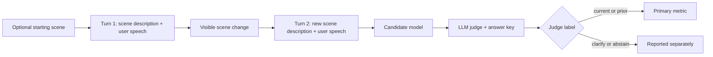

# Wearable Assistant Context Bench

[](https://github.com/n-dryer/wearable-assistant-context-bench/actions/workflows/test.yml)
[](https://www.python.org/downloads/)
[](LICENSE)

A model-selection benchmark for live AI wearable assistants.

Wearable assistants need to keep up while a user talks and moves. A user might ask about a tool, look at a screen, walk to another place, or pick up a different object without explaining the change out loud. The assistant should actively use the latest audio, video, and text context, so the user does not have to narrate every shift.

This benchmark tests one part of that problem: cross-turn reference resolution. Can a model answer the next question using the scene the user means now? In benchmark terms, it tests cross-turn multimodal reference resolution. This is not dialogue state tracking; the resolution depends on a perceptual frame, not on slot-filling intent.

The current version uses text as a proxy for real video and live audio. Spoken turns are represented as transcripts. Video frames are represented as written scene descriptions. A planned next version will add real video scenarios, so the same reference-tracking task can be tested with visual input directly.

Use the score as one signal when comparing models for wearable assistant products. It does not test the full device experience.

## Quick links

| Need | Start here |
|---|---|
| Interpret scores | [`docs/benchmark_spec.md`](docs/benchmark_spec.md) |
| Reproduce the published runs | [`data/README.md`](data/README.md#reproducing-the-published-runs) |
| Read the benchmark design | [`docs/benchmark_spec.md`](docs/benchmark_spec.md) |
| Configure API keys | [`docs/api_keys.md`](docs/api_keys.md) |
| Run open-weight models | [`docs/running_open_weights.md`](docs/running_open_weights.md) |
| Read the published findings | [`RESULTS.md`](RESULTS.md) |
| Look up a term | [`docs/glossary.md`](docs/glossary.md) |
| Report an issue | [GitHub Issues](https://github.com/n-dryer/wearable-assistant-context-bench/issues) |

## Results

Six published runs ship with the release.

- Five runs use the 50-scenario Scenario Bank (`subset: bank`).
- The `contrast` run uses a separate 20-scenario contrast pack where earlier objects or scenes may still be visible. These are controlled minimal pairs. ("Adversarial" in ML usually means inputs optimized to attack a specific model; that is not what this pack does.)

The primary metric is the mean of `current_recall` and `prior_recall`: how often the model answers correctly when the new scene matters, and how often it avoids switching when the earlier context is still the right answer. These are class recall values (TP / (TP + FN)), not overall accuracy. With four judge labels (`current`, `prior`, `clarify`, `abstain`), a trial is correct only when the judge label equals the scenario's `target_context`.

The strongest published Scenario Bank result is `baseline-alt`, with a **77.7%** primary metric. Without the scene description, the same base model scores **14.4%**. That drop is the simplest check that the task depends on visual context.

| Run | Candidate | Judge | Primary metric (95% CI) |
|---|---|---|---|
| **baseline** | `gemini-2.5-flash-lite` | `gemini-2.5-flash-lite` (same-family) | **60.6%** (54.1&ndash;67.1) |
| **baseline-alt** | `gemini-2.5-flash` | `gemini-2.5-flash-lite` (same-family) | **77.7%** (71.3&ndash;84.0) |
| **ablation-no-camera** | `gemini-2.5-flash-lite` with `--no-camera` | `gemini-2.5-flash-lite` | **14.4%** (9.1&ndash;19.7) |
| **baseline-qwen-cross-family** | `dashscope-intl/qwen3-vl-plus` | `gemini-2.5-flash-lite` (cross-family) | **54.2%** (50.7&ndash;57.7) |
| **baseline-deictic-repair** | `gemini-2.5-flash-lite` with `--repair-style deictic` | `gemini-2.5-flash-lite` | **60.6%** (54.1&ndash;67.1) |
| **contrast** | `gemini-2.5-flash-lite` (OpenRouter) | `gpt-4o-mini` (cross-family); `claude-haiku-4.5` shared judge | **67.3%** (55.5&ndash;79.1) |

*Runs dated 2026-04-25; manifest hashes pinned in [`data/MANIFEST.lock.json`](data/MANIFEST.lock.json).*

Reproduce `baseline-alt` (the strongest published score):

```bash
wac-bench \
  --model gemini/gemini-2.5-flash \
  --judge-model gemini/gemini-2.5-flash-lite --judge-family gemini \
  --output-dir runs/baseline-alt
```

The other rows are documented in [`data/README.md`](data/README.md#reproducing-the-published-runs).

More detail:

- Per-class recall (current vs prior): [`data/README.md`](data/README.md#per-class-recall)
- Score interpretation: [`docs/benchmark_spec.md`](docs/benchmark_spec.md)
- Reproduction commands: [`data/README.md`](data/README.md#reproducing-the-published-runs)

## Quick Start

Requires Python 3.11+. The fastest path uses [`uv`](https://docs.astral.sh/uv/), Astral's Python project manager.

### Install with uv (recommended)

```bash
git clone https://github.com/n-dryer/wearable-assistant-context-bench.git
cd wearable-assistant-context-bench

uv sync --extra dev
cp .env.example .env   # then add your provider keys
uv run wac-bench --help
```

`uv sync` creates the virtual environment, resolves and installs all dependencies, and registers the `wac-bench` console command in one step. The test suite does not require API access:

```bash
uv run pytest -q
```

### Install with pip

```bash
python -m venv .venv
source .venv/bin/activate
pip install -e ".[dev]"
cp .env.example .env
wac-bench --help
```

All runs default to temperature 0.0 for reproducibility. See [`docs/api_keys.md`](docs/api_keys.md) for provider-specific key setup.

### Run a candidate model

```bash
wac-bench --model <candidate_model_id>
```

For exact commands used in the published runs, see [`data/README.md`](data/README.md#reproducing-the-published-runs). For open-weight Hugging Face models, see [`docs/running_open_weights.md`](docs/running_open_weights.md).

### Common commands

```bash
pytest -q                         # Run tests
python scripts/validate_scenarios.py  # Validate the bank
wac-bench --help                  # Show runner options
```

## Benchmark design

This section explains what the benchmark sends to the model, how the scenarios work, and how responses are scored.

### Inputs

The current version does not use raw audio or raw video.

- Audio is represented as text transcripts.
- Video is represented as written scene descriptions.

The next version is planned to include real-video test scenarios. The goal is to keep the same reference-tracking task while testing whether models can read the visual scene directly.

For the full input design and limits of the benchmark, see [`docs/benchmark_spec.md`](docs/benchmark_spec.md).

### Evaluation flow



### Scenarios and packs

Each scenario is a three-turn conversation. Between Turn 1 and Turn 2, the user changes what they are holding, viewing, doing, or referring to. The user does not spell out the change. The model has to answer the Turn 2 question using the scene the user means at that moment.

The scene descriptions include visible details such as shape, material, color, motion, and position. They avoid naming the object directly.

| Subset (`subset` value) | Size | Purpose | Status |
|---|---:|---|---|
| Scenario Bank (`bank`) | 50 scenarios | Primary subset across 8 shift types | Published |
| Contrast (`contrast`) | 20 scenarios | Distractor-rich minimal pairs where the earlier object or scene may still be visible | Published |

The Scenario Bank covers 8 shift types: `object_in_hand`, `object_state`, `sequential_task`, `location`, `object_in_view`, `absent_referent`, `screen_content`, and `cross_session_reference`.

For category counts, scenario fields, and authoring rules, see the [dataset card](data/README.md#shift-type-distribution-change_type), [schema](docs/schema.md), and [authoring rules](docs/scenario_authoring_rules.md).

### Scoring and judging

Each scenario is scored on Turn 2, after the scene changes.

| Label | Meaning |
|---|---|
| `current` | The response answers using the new scene |
| `prior` | The response answers using the earlier scene |
| `clarify` | The response asks for clarification instead of answering |
| `abstain` | The response avoids answering |

The primary metric measures whether the model can separate the new scene from the earlier scene. `clarify` and `abstain` are counted separately.

```text
primary_score = mean(current_recall, prior_recall)
```

`current_recall` and `prior_recall` are per-class recall values (TP / (TP + FN)), not overall accuracy. Reports include a non-parametric bootstrap 95% CI on the primary metric in addition to the per-class Wilson CIs.

By default (`--judge-family auto`), the judge comes from a different model family than the candidate. This reduces the risk that a model family favors its own outputs. To rank candidates directly against each other, add `--ranking-judge-family` for one judge held constant across all of them.

Full rationale: [`docs/benchmark_spec.md`](docs/benchmark_spec.md).

## What this benchmark does not measure

Evaluate these separately:

- Coaching advice quality (correctness, safety, domain appropriateness)
- Multi-turn dynamics beyond three turns
- Latency, cost, and serving characteristics
- Speaker attribution, addressee detection, ambient audio

For the full scope statement, see [`docs/benchmark_spec.md`](docs/benchmark_spec.md#scope-boundaries-out-of-scope-by-design-vs-limitations).

## Code layout

| Path | Purpose |
|---|---|
| [`wearable_assistant_context_bench/`](wearable_assistant_context_bench) | Package: adapters, judge, scoring, report, runner |
| [`data/`](data) | Frozen scenario bank, prompt conditions, runtime config, lockfile |
| [`runs/`](runs) | Published baseline run results (findings.md + summary.json) |
| [`tests/`](tests) | Runtime and input-validation tests |
| [`scripts/`](scripts) | `validate_scenarios.py`, `regen_manifest_lock.py`, `analyze_runs.py` |
| [`.env.example`](.env.example) | Environment variable template |

## Contributing

Edits that change scenario text, gold-label vocabulary, prompt text, or scoring semantics are out of scope between releases. Those changes break cross-model comparability and require a coordinated `BENCHMARK_VERSION` bump rather than an in-place edit.

Bug fixes, new model adapters, documentation fixes, and reproducibility improvements are welcome through issues and pull requests.

For bugs, failed reproduction attempts, or unclear documentation, open a GitHub issue with the command you ran, the model or provider used, and the relevant error output.

See [`CONTRIBUTING.md`](CONTRIBUTING.md) for the full policy.

## License

Released under the MIT License. See [LICENSE](LICENSE).

## Citation

Maintained by Nate Dryer ([@n-dryer](https://github.com/n-dryer)).

If you reference this benchmark, use the citation metadata in [CITATION.cff](CITATION.cff) or copy the BibTeX entry below.

```bibtex
@software{dryer_wearable_assistant_context_bench_2026,
  author = {Dryer, Nate},
  title = {{Wearable Assistant Context Bench}},
  year = {2026},
  url = {https://github.com/n-dryer/wearable-assistant-context-bench},
  version = {0.1.0},
  license = {MIT}
}
```
