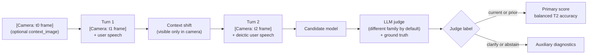

# Wearable Assistant Context Benchmark

[](https://github.com/n-dryer/wearable-assistant-context-bench/actions/workflows/test.yml)
[](https://www.python.org/downloads/)
[](LICENSE)

A benchmark for measuring whether multimodal assistants update to
current context instead of staying anchored to prior context.

## Why this exists

This benchmark was built to support a practical model-selection
decision for a live wearable assistant.

The product problem is simple:

- A user asks about the bedroom walls, walks into the kitchen, then
  asks about the walls again. The assistant answers as if the user is
  still in the bedroom.
- A user asks about a hammer, puts it down, picks up a screwdriver,
  then asks, "how do I use this?" The assistant answers about the
  hammer.

Users should not have to keep restating what they are looking at,
holding, or referring to. The assistant should infer the right
reference from the situational cues already present in the
interaction. One-off examples are not enough to make a model-selection
call. Every candidate needs to be tested on the same scenarios, with
the same prompt conditions, the same judge rules, and a saved run
record.

## What this benchmark measures

This benchmark measures **context tracking**. It tests whether a
model uses the current situational evidence visible in the camera
frame, or stays anchored to prior context after a shift.

The bank is **50 scenarios across 8 shift-type categories**: object in
hand, object state, sequential task, location, object in view, absent
referent, screen content, and pre-conversation recall. Each scenario
is a three-turn conversation with scene descriptions injected on the user
side as `[Camera: ...]` blocks. Scene descriptions are what a vision
system would say about a camera frame: shape, material, color,
motion, position, without naming the object directly. The model has
to integrate those camera blocks with the deictic user speech to
figure out what context the question refers to.

The judge labels each Turn 2 response with one of `current`, `prior`,
`clarify`, or `abstain`. The primary score is balanced accuracy across
`current` and `prior` under the `baseline` prompt condition.

## What this benchmark does NOT measure

This is a context-tracking benchmark. It is not a coaching benchmark.
It does not directly evaluate:

- Whether the coaching advice is correct, safe, or domain-appropriate
- Multi-turn conversation dynamics beyond a three-turn structure
- Performance on real video frames (the camera channel uses
  scene descriptions in text as a proxy)
- Proactive coaching, noticing without being asked
- Domain knowledge depth (cooking, woodworking, music, fitness, etc.)
- Latency, cost, audio perception, speaker attribution, or long-horizon
  memory across sessions

A model that fails this benchmark is unlikely to be viable as a
wearable assistant. A model that passes still needs separate
evaluation for everything in this list.

## How it works



The candidate sees the audio channel (user speech) and the camera
channel (scene descriptions). The judge also receives a
ground-truth section that names the actual objects in Turn 1 and
Turn 2; the candidate never sees that. Each scenario runs across
three prompt conditions (`baseline`, `condition_a`, `condition_b`) at
temperature 0. Turn 3 fires only after a Turn 2 miss and feeds the
repair rate.

## Repository layout

- [`benchmark/v1`](benchmark/v1): scenario bank, runner, and run
  outputs
- [`core`](core): model adapters, judge logic, scoring, report
  generation
- [`docs/benchmark_spec.md`](docs/benchmark_spec.md): full benchmark
  specification
- [`docs/schema.md`](docs/schema.md): scenario field reference
- [`docs/scenario_authoring_rules.md`](docs/scenario_authoring_rules.md):
  authoring rules and validation checklist
- [`docs/benchmark_notes.md`](docs/benchmark_notes.md): score
  interpretation and limitations
- [`tests`](tests): runtime and input-validation tests
- [`scripts/validate_scenarios.py`](scripts/validate_scenarios.py):
  programmatic checks against the scenario bank

## Install

Requires Python 3.11+.

```bash
python3 -m venv .venv
. .venv/bin/activate
pip install -r requirements.txt
python -m spacy download en_core_web_sm
```

Set the API keys you need for the candidate and judge models you plan
to run:

- `ANTHROPIC_API_KEY`
- `GEMINI_API_KEY` or `GOOGLE_API_KEY`
- `OPENAI_API_KEY`
- `OPENROUTER_API_KEY`
- `HF_TOKEN` and, when needed, `HUGGINGFACE_API_KEY` for supported
  Hugging Face inference routes

An example environment file is provided in [`.env.example`](.env.example).

## Run the benchmark

```bash
python -m benchmark.v1.run \
  --model <candidate_model_id> \
  --judge-model <judge_model_id>
```

Optional flags:

- `--judge-family auto|claude|gemini|openai`: judge family override.
  Default is `auto`, which picks a different family than the candidate.
- `--trials <int>`: trials per (scenario, condition) cell. Default is 2.
- `--output-dir <path>`: output directory. Default is
  `benchmark/v1/runs/latest/`.

The runner writes `transcripts.jsonl`, `findings.md`, and a
reproducibility manifest into the output directory.

## Verify the repo

```bash
python -m pytest tests/ -q
python scripts/validate_scenarios.py
```

The test suite stubs candidate models and the judge so the runtime
tests work without API access. The validator script runs four
programmatic checks (token leakage, object-name leakage, schema
validation, cross-scenario duplication) over the scenario bank.

## How the judge works

The judge is a second model that labels each Turn 2 response with
one of `current`, `prior`, `clarify`, or `abstain`.

By default, `--judge-family auto` resolves to a different model family
than the candidate (Claude candidate → Gemini judge, Gemini candidate
→ OpenAI judge, OpenAI candidate → Gemini judge). This reduces
**self-preference bias**, the tendency of a model to rate outputs from
its own family more favorably. Explicit `claude`, `gemini`, and
`openai` overrides are supported.

The judge receives the same audio and camera channels as the
candidate, plus a ground-truth section that names the actual objects
in the Turn 1 and Turn 2 frames. The candidate never sees this
ground-truth section. The split lets the judge reliably determine
whether the response reflects Turn 2 (current) or Turn 1 (prior)
context.

## How to read the primary score

The primary score is **balanced Turn 2 accuracy across `current` and
`prior` under `baseline`**.

Balanced means the mean of per-class accuracy across the two scored
classes, so one class does not dominate the headline number.
`baseline` is the default comparison condition; `condition_a` and
`condition_b` are prompt-sensitivity checks, not replacement scores.

On this benchmark, score deltas matter more than absolute values.
Treat differences between models on the same release as the signal.
For interpretation guidance, see
[`docs/benchmark_notes.md`](docs/benchmark_notes.md).

## Results

Four runs are published with v1: an original same-family baseline,
two cross-family runs covering two different candidate model families,
and a camera channel ablation.

Headline table, primary score (balanced Turn 2 accuracy under
`baseline`):

| Run | Candidate | Judge | Camera | Primary score |
|-----|-----------|-------|--------|---------------|
| Original | `gemini-2.5-flash-lite` | `gemini-2.5-flash-lite` (same family) | on | 98.5% |
| **Run A** | `gemini-2.5-flash-lite` | `gpt-4o-mini` (cross family) | on | **92.8%** |
| **Run B** | `gpt-4o-mini` | `gemini-2.5-flash-lite` (cross family) | on | **100.0%** |
| **Run C** | `gemini-2.5-flash-lite` | `gpt-4o-mini` (cross family) | **off** | **7.2%** |

All runs: 50 scenarios, 3 prompt conditions, 2 trials per cell, 300
total cells per run. All candidates are vision-capable models from
families that ship full omnimodal stacks suitable for a wearable
deployment (vision in, audio in, audio out, real-time streaming).

### What the runs show

- **Cross-family judging correction.** Switching from same-family
  judging (Original, 98.5%) to cross-family judging (Run A, 92.8%)
  drops the same Gemini candidate's score by 5.7 percentage points.
  This is the self-preference bias correction in action.
- **Multi-model comparison.** GPT-4o-mini (Run B, 100.0%) clearly
  outperforms Gemini Flash Lite (Run A, 92.8%) on this task. Both
  numbers come from cross-family judging, so the comparison is
  apples-to-apples.
- **Camera channel ablation.** With the camera channel turned off
  (Run C, 7.2%), the same Gemini candidate that scored 92.8% with
  the camera collapses to near-floor. The 85.6 percentage point gap
  is the camera channel's contribution under `baseline`. The camera
  channel is doing real work, not decoration.

Per-class accuracy in each run is in the run's `findings.md`. Full
transcripts are at:

- `benchmark/v1/runs/baseline/` (Original)
- `benchmark/v1/runs/baseline-cross-family-a/` (Run A)
- `benchmark/v1/runs/baseline-cross-family-b/` (Run B)
- `benchmark/v1/runs/baseline-ablation-no-camera/` (Run C)

### How to read these results

These four runs are not a complete leaderboard. They are the v1
release set: enough to show the benchmark works end-to-end, that
cross-family judging matters, that the camera channel matters, and
that two different candidate models produce meaningfully different
scores. Score deltas between runs on the same scenario bank are the
right signal. See
[`docs/benchmark_notes.md`](docs/benchmark_notes.md) under "Known v1
limitations and future work."

## Contributing

Edits that change scenario text, answer keys, prompt text, or scoring
semantics are out of scope once the `v1.0.0` release tag is created.
Bug fixes, new model adapters, doc improvements, and reproducibility
improvements are welcome at any time. See
[`CONTRIBUTING.md`](CONTRIBUTING.md) for the full policy.

## License

Released under the MIT License. See [LICENSE](LICENSE).

## Citation

If you reference this benchmark, use the citation metadata in
[CITATION.cff](CITATION.cff).
