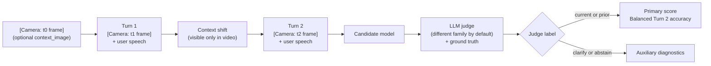

# Wearable Assistant Context Benchmark

[](https://github.com/n-dryer/wearable-assistant-context-bench/actions/workflows/test.yml)
[](https://www.python.org/downloads/)
[](LICENSE)

A multimodal AI assistant the user is actively using for advice or
coaching (wearable or handheld, with audio/video/text input and
audio/text output) sees what the user sees and hears what they say.
When the user's situation changes (they swap tools, walk into a new
room), does the assistant follow along, or stay stuck on what was
happening before? This benchmark scores that.

## Why this exists

This benchmark supports model selection for deployed multimodal AI
assistants used actively for advice or coaching. Form factors covered
include wearable (smart glasses, ear-worn devices) and handheld
(phone-as-coach apps, AR/MR devices held in hand).

The product problem is simple:

- A user asks about the bedroom walls, walks into the kitchen, then
  asks about the walls again. The assistant answers as if the user is
  still in the bedroom.
- A user asks about a hammer, puts it down, picks up a screwdriver,
  then asks, "how do I use this?" The assistant answers about the
  hammer.

Users should not have to keep restating what they are looking at,
holding, or referring to. The assistant should infer the right
reference from the situational cues already present in the
interaction. One-off examples are not enough to make a model-selection
call. Every candidate needs to be tested on the same scenarios, with
the same prompt conditions, the same judge rules, and a saved run
record.

## What this benchmark measures

This benchmark measures **context tracking**. It tests whether a
model uses the current situational evidence visible in the video
input, or stays anchored to prior context after a shift.

The bank is **50 scenarios across eight kinds of context shift**:
object in hand, object state, sequential task, location, object in
view, absent referent, screen content, and pre-conversation recall.
Each scenario has three turns, with scene descriptions injected on
the user side as `[Camera: ...]` blocks (the literal field name from
the scenario JSON). Scene descriptions are what a vision system would
say about a video frame: shape, material, color, motion, position,
without naming the object directly. The model has to combine those
scene blocks with user speech that depends on the scene to figure out
what the question is about.

The judge labels each Turn 2 response with one of `current`, `prior`,
`clarify`, or `abstain`. The primary score is **Balanced Turn 2
accuracy**: the macro-averaged accuracy across `current` and `prior`
classes under the `baseline` system prompt.

### How v1 represents audio and video

In v1, the user's spoken turns are represented as **text transcripts**,
not raw audio. The benchmark does not test acoustic grounding, speaker
attribution, addressee detection, or ambient audio cues. Similarly,
the camera channel is represented as **scene descriptions in text**
as a proxy for what a real wearable's vision system would produce
from a camera frame; the benchmark does not score performance on real
video. Both proxies are deliberate: they let the benchmark isolate
context-tracking ability from the variability of the perceptual
front-end. Adding raw-audio and real-video variants is acknowledged
as v2 work; see [`docs/benchmark_notes.md`](docs/benchmark_notes.md).

## What this benchmark does NOT measure

This is a context-tracking benchmark. It is not a coaching benchmark.
It does not directly evaluate:

- Whether the coaching advice is correct, safe, or domain-appropriate
- Multi-turn conversation flow past Turn 2
- Performance on real video frames (the video channel uses scene
  descriptions in text as a proxy)
- Performance on raw audio (the audio channel uses text transcripts
  as a proxy; acoustic grounding, speaker attribution, addressee
  detection, and ambient audio cues are not tested)
- Proactive coaching, noticing without being asked
- Domain knowledge depth (cooking, woodworking, music, fitness, etc.)
- Latency, cost, or long-horizon memory across sessions

A model that fails this benchmark cannot serve as an in-the-moment
multimodal assistant. A model that passes still needs separate
evaluation for everything in this list.

v1 runs 5 trials per cell and reports 95% confidence intervals on
every score, so deltas can be interpreted against sampling noise.
Inter-judge agreement (Cohen's kappa across two cross-family judges)
is reported alongside primary scores.

## How it works



The candidate sees the audio channel (user speech) and the video
channel (scene descriptions). The judge also receives a ground-truth
section that names the actual objects in Turn 1 and Turn 2; the
candidate never sees that. Each scenario runs under three system
prompts (the neutral `baseline` plus `condition_a` and `condition_b`,
two nudge variants) at temperature 0. Turn 3 fires only after a
Turn 2 miss and feeds the repair rate.

## Repository layout

- [`benchmark/v1`](benchmark/v1): scenario bank, runner, and run
  outputs
- [`core`](core): model adapters, judge logic, scoring, report
  generation
- [`docs/benchmark_spec.md`](docs/benchmark_spec.md): full benchmark
  specification
- [`docs/schema.md`](docs/schema.md): scenario field reference
- [`docs/scenario_authoring_rules.md`](docs/scenario_authoring_rules.md):
  authoring rules and validation checklist
- [`docs/benchmark_notes.md`](docs/benchmark_notes.md): score
  interpretation and limitations
- [`tests`](tests): runtime and input-validation tests
- [`scripts/validate_scenarios.py`](scripts/validate_scenarios.py):
  programmatic checks against the scenario bank

## Quickstart

```bash
git clone https://github.com/n-dryer/wearable-assistant-context-bench.git
cd wearable-assistant-context-bench
./scripts/setup.sh
. .venv/bin/activate

# Verify the repo without API access (stubs both candidate and judge):
python -m pytest tests/ -q
python scripts/validate_scenarios.py

# Run the benchmark against a real model (requires API keys, see below):
cp .env.example .env  # then fill in keys
python -m benchmark.v1.run --model <candidate_model_id>
```

`scripts/setup.sh` creates the venv, installs pinned dependencies,
and downloads the spaCy `en_core_web_sm` model (needed by the
validator and the scoring code path). Override the Python interpreter
with `PYTHON=python3.13 ./scripts/setup.sh` if you need a specific
version.

## Install

Requires Python 3.11+.

The `Quickstart` block above is the canonical install sequence.
Set the API keys you need for the candidate and judge models you plan
to run:

- `ANTHROPIC_API_KEY`
- `GEMINI_API_KEY` or `GOOGLE_API_KEY`
- `OPENAI_API_KEY`
- `OPENROUTER_API_KEY`
- `HF_TOKEN` (and `HUGGINGFACE_API_KEY` as a fallback name) for
  Hugging Face Inference Providers

An example environment file is provided in [`.env.example`](.env.example).

### Using Hugging Face Inference Providers as a candidate

Open-weights multimodal candidates can run via [HF Inference
Providers](https://huggingface.co/docs/inference-providers/index)
(`router.huggingface.co`). Authenticate with `HF_TOKEN` (a
fine-grained token with *Make calls to Inference Providers*
permission). HF Pro accounts get included Inference Provider credits
each month; additional usage is billed at provider rates with no
markup.

Model ids use the format `huggingface/<inference_provider>/<hf_org>/<hf_model>`.
The benchmark works with any chat-completion-capable model, but
candidates must support real wearable or handheld deployment
(multimodal: live audio in/out, streaming, video). The v1
measurement is text-form, but the deployment target needs vision.

Recommended candidates (efficiency vs. capability):

| Model | Model id (LiteLLM format) | Notes |
| --- | --- | --- |
| Qwen 2.5 VL 7B | `huggingface/together/Qwen/Qwen2.5-VL-7B-Instruct` | Best balance: leading open VLM, fast and cheap |
| Llama 3.2 Vision 11B | `huggingface/together/meta-llama/Llama-3.2-11B-Vision-Instruct` | Proven, broadly supported across providers |
| Qwen 2.5 VL 72B | `huggingface/fireworks-ai/Qwen/Qwen2.5-VL-72B-Instruct` | Frontier open-weights VLM; higher cost |

Other HF Inference Provider partners that support vision-language
chat completion include Cohere, Featherless AI, Fireworks, Groq,
Hyperbolic, Novita, Nscale, OVHcloud, Together, and Z.ai. The
specific provider segment in the model id determines routing; pick
based on availability and pricing.

Worked example invocation:

```bash
python -m benchmark.v1.run \
  --model huggingface/together/Qwen/Qwen2.5-VL-7B-Instruct \
  --judge-family openai \
  --judge-model openrouter/openai/gpt-4o-mini \
  --output-dir benchmark/v1/runs/qwen-vl-7b
```

`--judge-family` is required for open-weights HF candidates because
the cross-family judge auto-resolution map only covers Claude,
Gemini, and OpenAI today. Pick the family different from the
candidate's training lineage to preserve self-preference-bias
correction. The runner will surface a clear error if you pass
`--judge-family auto` against an open-weights HF candidate.

## Run the benchmark

```bash
python -m benchmark.v1.run \
  --model <candidate_model_id> \
  --judge-model <judge_model_id>
```

Optional flags:

- `--judge-family auto|claude|gemini|openai`: judge family override.
  Default is `auto`, which picks a different family than the candidate.
- `--trials <int>`: trials per (scenario, condition) cell. Default is 5.
- `--output-dir <path>`: output directory. Default is
  `benchmark/v1/runs/latest/`.

The runner writes `transcripts.jsonl` and `findings.md` (which
includes a reproducibility manifest as a JSON block) into the
output directory.

## Verify the repo

```bash
python -m pytest tests/ -q
python scripts/validate_scenarios.py
```

The test suite stubs candidate models and the judge so the runtime
tests work without API access. The validator script runs four
programmatic checks (token leakage, object-name leakage, schema
validation, cross-scenario duplication) over the scenario bank.

## How the judge works

A second model labels each Turn 2 response with one of `current`,
`prior`, `clarify`, or `abstain`. v1 supports two judge roles:

**Cross-family judge (per-run integrity).** By default,
`--judge-family auto` resolves to a different family than the
candidate (Claude → Gemini, Gemini → OpenAI, OpenAI → Gemini). This
reduces **self-preference bias**: the tendency of a model to rate
outputs from its own family more favorably. Per-family default judge
models are in [`core/llm_judge.py`](core/llm_judge.py): Claude →
`openrouter/anthropic/claude-sonnet-4.6`, Gemini →
`gemini-2.5-flash`, OpenAI → `openai/gpt-4.1-mini`. Pass
`--judge-model <id>` to override.

**Fixed ranking judge (cross-candidate comparability).** Cross-family
judging removes self-preference within a run but does not isolate
candidate quality from judge strictness across runs. To rank two
candidates apples-to-apples, configure a fixed ranking judge with
`--ranking-judge-family {claude|gemini|openai}` (and optionally
`--ranking-judge-model <id>`). Each trial then carries both verdicts
in its transcript. The findings report includes an "Inter-judge
agreement (cross-LLM)" section with Cohen's kappa and per-scenario
disagreement counts, used as a substitute for human inter-annotator
agreement (v2 work).

**Ground-truth visibility.** The judge receives the same audio and
video channels as the candidate, plus a ground-truth section naming
the actual objects in the Turn 1 and Turn 2 frames. The candidate
never sees this section. The judge does **not** see the scenario's
`target_context` label, `cue_type` shift category, or authoring
`notes`. Those would name the answer. The constraint is enforced
by [`tests/test_judge_prompt_constraints.py`](tests/test_judge_prompt_constraints.py).

## How to read the primary score

The primary score is **Balanced Turn 2 accuracy**: the macro-average
of `current` and `prior` class accuracies under `baseline`.

Macro-averaging weights each class equally, so the larger `current`
class doesn't dominate the headline number. `baseline` is the default
comparison system prompt; `condition_a` and `condition_b` are
prompt-sensitivity checks, not replacement scores.

On this benchmark, score deltas matter more than absolute values.
Treat differences between models on the same release as the signal.
For interpretation guidance, see
[`docs/benchmark_notes.md`](docs/benchmark_notes.md).

## Results

v1 publishes six runs across the canonical 50-scenario bank and the
adversarial 20-scenario distractor-rich pack. All use 5 trials per
cell and report 95% Wilson CIs per class plus 95%
normal-approximation CIs on the balanced mean. A third pack — 15
ceiling-test scenarios in `scenarios_v2_candidates.json` (all
`difficulty_tier: hard`) — is wired via `--pack hard` for users who
want to push frontier models, but no run is published against it
yet.

| Run | Candidate | Judge | Pack | Primary score (95% CI) |
|---|---|---|---|---|
| **baseline** | `gemini-2.5-flash-lite` | `gemini-2.5-flash-lite` (same-family) | canonical 50 | **60.6%** (54.1–67.1) |
| **baseline-alt** | `gemini-2.5-flash` | `gemini-2.5-flash-lite` (same-family) | canonical 50 | **77.7%** (71.3–84.0) |
| **ablation-no-camera** | `gemini-2.5-flash-lite`, `--no-camera` | `gemini-2.5-flash-lite` | canonical 50 | **14.4%** (9.1–19.7) |
| **baseline-qwen-cross-family** | `dashscope-intl/qwen3-vl-plus` | `gemini-2.5-flash-lite` (cross-family) | canonical 50 | **54.2%** (50.7–57.7) |
| **baseline-deictic-repair** | `gemini-2.5-flash-lite`, `--repair-style deictic` | `gemini-2.5-flash-lite` | canonical 50 | **60.6%** (54.1–67.1) |
| **adversarial** | `gemini-2.5-flash-lite` (OpenRouter) | `gpt-4o-mini` (cross-family); `claude-haiku-4.5` ranking judge | adversarial 20 | **67.3%** (55.5–79.1) |

Per-class accuracy under `baseline` (full table per run in
`runs/<name>/findings.md`):

| Run | `current` | `prior` |
|---|---|---|
| baseline | 87.9% (82.0–92.0) | 33.3% (22.7–45.9) |
| baseline-alt | 97.0% (93.1–98.7) | 58.3% (45.7–69.9) |
| ablation-no-camera | 12.1% (8.0–18.0) | 16.7% (9.3–28.0) |
| baseline-qwen-cross-family | 100.0% (97.7–100.0) | 8.3% (3.6–18.1) |
| baseline-deictic-repair | 87.9% (82.0–92.0) | 33.3% (22.7–45.9) |
| adversarial | 84.6% (73.9–91.4) | 50.0% (29.9–70.1) |

### What the runs show

- **The model is leaning heavily on the camera input.** Same
  candidate and judge, only the camera description toggled:
  `baseline` 60.6% → `ablation-no-camera` 14.4%. A 46.2 percentage
  point gap. This rules out one alternative reading: the model
  isn't solving from question phrasing alone. It does not on its
  own prove context tracking; the per-class pattern below does.
- **The model handles "current" but stumbles on "prior".** Across
  all six runs the model is much better when the answer is about
  the most recent frame than when the answer is about an earlier
  frame. `baseline-qwen-cross-family` is the clearest example:
  100% on `current`, 8.3% on `prior`. The model grounds in the
  latest visual input and struggles to refer back. Together with
  the camera ablation above, this is the capability gap the
  benchmark targets.
- **Bigger sibling helps, on the same family.** Gemini-Flash
  (`baseline-alt`, 77.7%) outperforms Gemini-Flash-Lite
  (`baseline`, 60.6%) on the same scenario set with the same judge.
- **Same-family judging may inflate the canonical Gemini numbers.**
  The `baseline-qwen-cross-family` run (cross-family judging) lands
  at 54.2% on the same scenario set vs `baseline`'s 60.6%, a 6.4
  pp gap consistent with self-preference bias on the same-family
  runs (though candidate quality also differs; see "Caveats").
- **Cross-LLM judge agreement on the adversarial pack:** Cohen's
  kappa = 0.443 across `gpt-4o-mini` and `claude-haiku-4.5`. The
  two cross-family judges disagreed on 110 of 300 trials (36.7%).
  This is the only v1 run that reports a cross-LLM agreement
  metric, since the canonical runs ran a single judge each.
- **Deictic-only repair recovers 100% of misses where it applies;
  named repair recovers 30% of misses where it falls back.** The
  `baseline-deictic-repair` run uses the deictic anchor on the 31
  visible-referent `current`-target scenarios and falls back to the
  named anchor on the rest. Repaired 50/50 deictic, 30/100 named.
  Reading: when the user can repair with a pointing gesture
  ("no, this, what I'm holding now"), the model recovers; when the
  miss is on `prior`/`abstain`/`clarify`-target scenarios where a
  pointing gesture cannot resolve the reference, named clarification
  rarely helps. Overall recovery rate is the same as the `baseline`
  run (53% of all misses); the deictic anchor concentrates the
  recoveries on the easier scenarios.
- **`condition_b` (pre-answer scaffold) consistently helps;
  `condition_a` (policy-instruction nudge) is mixed.** Across runs
  with measurable shift, the forced "identify the relevant context
  first" structure outperforms the looser instruction wording.

### Caveats

- **Same-family judging on four of five canonical runs.** API
  budget across providers (OpenRouter, OpenAI direct, HF Pro) was
  exhausted mid-effort, leaving Gemini Direct (via LiteLLM) as the
  only viable transport for the bulk of the canonical runs.
  Gemini-Flash-Lite judges Gemini-Flash-Lite (and Gemini-Flash)
  on `baseline`, `baseline-alt`, `ablation-no-camera`, and
  `baseline-deictic-repair`, which admits self-preference bias.
  `baseline-qwen-cross-family` is the cross-family integrity
  reference for the canonical bank; `adversarial` is the
  cross-family integrity reference for the adversarial pack.
- **Two model-config families across v1.** Five canonical runs use
  Gemini-direct + DashScope-International transports. Adversarial
  uses an OpenRouter setup with a Claude-Haiku ranking judge.
  Comparing within a single run is fully apples-to-apples;
  comparing across runs requires reading the candidate and judge
  identifiers in each `findings.md` manifest.
- **`baseline-qwen-cross-family` candidate scoring isolated.** The
  Qwen3-VL-Plus candidate has not been evaluated against a fixed
  ranking judge alongside the Gemini candidates, so it cannot yet
  be ranked head-to-head with `baseline` or `baseline-alt`.
  Cross-candidate ranking is a v1.0.x follow-up.

Full transcripts and per-scenario matrices live in:

- `benchmark/v1/runs/baseline/`
- `benchmark/v1/runs/baseline-alt/`
- `benchmark/v1/runs/ablation-no-camera/`
- `benchmark/v1/runs/baseline-qwen-cross-family/`
- `benchmark/v1/runs/baseline-deictic-repair/`
- `benchmark/v1/runs/adversarial/`

## Contributing

Edits that change scenario text, answer keys, prompt text, or scoring
semantics are out of scope once the `v1.0.0` release tag is created.
Bug fixes, new model adapters, doc improvements, and reproducibility
improvements are welcome at any time. See
[`CONTRIBUTING.md`](CONTRIBUTING.md) for the full policy.

## License

Released under the MIT License. See [LICENSE](LICENSE).

## Citation

If you reference this benchmark, use the citation metadata in
[CITATION.cff](CITATION.cff).
