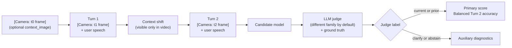

# Wearable Assistant Context Benchmark

[](https://github.com/n-dryer/wearable-assistant-context-bench/actions/workflows/test.yml)
[](https://www.python.org/downloads/)
[](LICENSE)

[](https://n-dryer.github.io/wearable-assistant-context-bench/)

A multimodal AI assistant the user is actively using for advice or
coaching (wearable or handheld, with audio/video/text input and
audio/text output) sees what the user sees and hears what they say.
When the user's situation changes (they swap tools, walk into a new
room), does the assistant follow along, or stay stuck on what was
happening before? **This benchmark scores that.**

## Headline numbers

| Effect | Number |
|---|---|
| Camera input is load-bearing | **60.6% &rarr; 14.4%** when the camera channel is stripped |
| Stuck on the latest frame | **100.0% on `current` / 8.3% on `prior`** (cross-family integrity reference) |
| Bigger sibling, same family | **77.7% vs 60.6%** (Gemini Flash vs Flash-Lite, McNemar p = 0.0012) |
| Cross-LLM judge agreement | Cohen's &kappa; = **0.443** (moderate) on the adversarial pack |

Full leaderboard and per-class breakdown are in [Results](#results).

## Documentation

- **Live results page**: <https://n-dryer.github.io/wearable-assistant-context-bench/>
- **[One-page card (HTML)](docs/benchmark_card.html)**: the polished overview
- **[`docs/benchmark_spec.md`](docs/benchmark_spec.md)**: full benchmark specification
- **[`docs/decisions.md`](docs/decisions.md)**: design tradeoffs
- **[`docs/benchmark_notes.md`](docs/benchmark_notes.md)**: score interpretation and limitations
- **[`benchmark/v1/dataset_card.md`](benchmark/v1/dataset_card.md)**: dataset scope, runs, caveats

## What this benchmark measures

This benchmark measures **context tracking** for multimodal AI
assistants used actively for advice or coaching. Form factors covered
include wearable (smart glasses, ear-worn devices) and handheld
(phone-as-coach apps, AR/MR devices held in hand).

The product problem: a user asks about a hammer, puts it down, picks
up a screwdriver, then asks, "how do I use this?" The assistant
should answer about the screwdriver, without the user having to
restate what they are holding.

The Scenario Bank is **50 scenarios across 8 shift-type categories**
(`object_in_hand`, `object_state`, `sequential_task`, `location`,
`object_in_view`, `absent_referent`, `screen_content`,
`pre_conversation_recall`; counts in
[`benchmark/v1/dataset_card.md`](benchmark/v1/dataset_card.md#shift-type-distribution-cue_type)).
Each scenario has three turns. Camera frames inject as `[Camera: ...]`
blocks containing scene descriptions — shape, material, color,
motion, position, without naming the object.

The judge labels each Turn 2 response as `current`, `prior`,
`clarify`, or `abstain`. The primary score is **Balanced Turn 2
accuracy**:

```text
primary_score = mean(current_accuracy, prior_accuracy)
```

The benchmark supports model-selection decisions for deployed
multimodal coaching assistants. v1 channels are text proxies: spoken
turns as text transcripts (not raw audio), camera frames as scene
descriptions (as a proxy for real video). Three-channel design and
proxy rationale:
[`docs/benchmark_spec.md`](docs/benchmark_spec.md#the-three-channel-design).

## Results

v1 publishes six runs across the Scenario Bank (50 scenarios) and the
adversarial 20-scenario distractor-rich pack. All use 5 trials per
cell and report 95% Wilson CIs per class plus 95%
normal-approximation CIs on the balanced mean. A third pack of 15
ceiling-test scenarios in `scenarios_v2_candidates.json` (all
`difficulty_tier: hard`) is wired via `--pack hard` for users who
want to push frontier models, but no run is published against it
yet.

| Run | Candidate | Judge | Pack | Primary score (95% CI) |
|---|---|---|---|---|
| **baseline** | `gemini-2.5-flash-lite` | `gemini-2.5-flash-lite` (same-family) | Scenario Bank | **60.6%** (54.1&ndash;67.1) |
| **baseline-alt** | `gemini-2.5-flash` | `gemini-2.5-flash-lite` (same-family) | Scenario Bank | **77.7%** (71.3&ndash;84.0) |
| **ablation-no-camera** | `gemini-2.5-flash-lite`, `--no-camera` | `gemini-2.5-flash-lite` | Scenario Bank | **14.4%** (9.1&ndash;19.7) |
| **baseline-qwen-cross-family** | `dashscope-intl/qwen3-vl-plus` | `gemini-2.5-flash-lite` (cross-family) | Scenario Bank | **54.2%** (50.7&ndash;57.7) |
| **baseline-deictic-repair** | `gemini-2.5-flash-lite`, `--repair-style deictic` | `gemini-2.5-flash-lite` | Scenario Bank | **60.6%** (54.1&ndash;67.1) |
| **adversarial** | `gemini-2.5-flash-lite` (OpenRouter) | `gpt-4o-mini` (cross-family); `claude-haiku-4.5` ranking judge | adversarial 20 | **67.3%** (55.5&ndash;79.1) |

Per-class accuracy under `baseline` (full table per run in
`benchmark/v1/runs/<name>/findings.md`):

| Run | `current` | `prior` |
|---|---|---|
| baseline | 87.9% (82.0&ndash;92.0) | 33.3% (22.7&ndash;45.9) |
| baseline-alt | 97.0% (93.1&ndash;98.7) | 58.3% (45.7&ndash;69.9) |
| ablation-no-camera | 12.1% (8.0&ndash;18.0) | 16.7% (9.3&ndash;28.0) |
| baseline-qwen-cross-family | 100.0% (97.7&ndash;100.0) | 8.3% (3.6&ndash;18.1) |
| baseline-deictic-repair | 87.9% (82.0&ndash;92.0) | 33.3% (22.7&ndash;45.9) |
| adversarial | 84.6% (73.9&ndash;91.4) | 50.0% (29.9&ndash;70.1) |

Run interpretation, statistical analysis, and score-reading guidance:
[`docs/benchmark_notes.md`](docs/benchmark_notes.md).

Per-row reproduction commands:
[`benchmark/v1/dataset_card.md`](benchmark/v1/dataset_card.md#reproducing-the-v1-runs).

### Caveats

- Same-family judging on four of five Scenario Bank runs; API budget
  across non-Gemini providers was exhausted mid-effort, leaving
  `baseline-qwen-cross-family` as the cross-family integrity
  reference for the Scenario Bank.
- Two model-config families across v1 (Gemini-direct +
  DashScope-International for the Scenario Bank, OpenRouter for the
  adversarial run); compare within a single run, or read each
  `findings.md` manifest before comparing across runs.
- `baseline-qwen-cross-family` cannot yet be ranked head-to-head with
  the Gemini Scenario Bank runs; cross-candidate ranking under a
  fixed ranking judge is a v1.0.x follow-up.

Full discussion and limitations are in
[`docs/benchmark_notes.md`](docs/benchmark_notes.md#caveats). Full
transcripts and per-scenario matrices live in
`benchmark/v1/runs/<name>/`.

## How it works



What's out of scope:
[`docs/benchmark_notes.md`](docs/benchmark_notes.md#what-this-benchmark-does-not-measure).

## Quickstart

Requires Python 3.11+. Copy [`.env.example`](.env.example) to `.env`
and set the keys for the candidate and judge models you plan to use:
`ANTHROPIC_API_KEY`, `GEMINI_API_KEY` (or `GOOGLE_API_KEY`),
`OPENAI_API_KEY`, `OPENROUTER_API_KEY`, `HF_TOKEN`.

```bash
git clone https://github.com/n-dryer/wearable-assistant-context-bench.git
cd wearable-assistant-context-bench
./scripts/setup.sh && . .venv/bin/activate

# Verify (no API access needed):
python -m pytest tests/ -q

# Run:
python -m benchmark.v1.run --model <candidate_model_id>
```

Run flags: `python -m benchmark.v1.run --help`. Open-weights HF
candidates: [`docs/running_open_weights.md`](docs/running_open_weights.md).

## How the judge works

A second model labels each Turn 2 response. `--judge-family auto`
picks a different family than the candidate to reduce
self-preference bias; `--ranking-judge-family` adds a fixed second
judge for cross-candidate ranking. Full rationale:
[`docs/decisions.md`](docs/decisions.md#why-cross-family-judging-by-default--a-fixed-ranking-judge).

## Repository layout

- [`benchmark/v1`](benchmark/v1): scenario bank, runner, and run
  outputs
- [`core`](core): model adapters, judge logic, scoring, report
  generation
- [`docs/benchmark_spec.md`](docs/benchmark_spec.md): full benchmark
  specification
- [`docs/schema.md`](docs/schema.md): scenario field reference
- [`docs/scenario_authoring_rules.md`](docs/scenario_authoring_rules.md):
  authoring rules and validation checklist
- [`docs/benchmark_notes.md`](docs/benchmark_notes.md): score
  interpretation and limitations
- [`docs/running_open_weights.md`](docs/running_open_weights.md):
  HF Inference Providers candidate setup
- [`tests`](tests): runtime and input-validation tests
- [`scripts/validate_scenarios.py`](scripts/validate_scenarios.py):
  programmatic checks against the scenario bank

## Contributing

Edits to scenario text, answer keys, prompt text, or scoring semantics
are out of scope once the `v1.0.0` release tag is created. Bug fixes
and new model adapters are welcome at any time, as are doc and
reproducibility improvements. See
[`CONTRIBUTING.md`](CONTRIBUTING.md) for the full policy.

## Maintainer

Nate Dryer ([@n-dryer](https://github.com/n-dryer)).

## License

Released under the MIT License. See [LICENSE](LICENSE).

## Citation

If you reference this benchmark, use the citation metadata in
[CITATION.cff](CITATION.cff).
