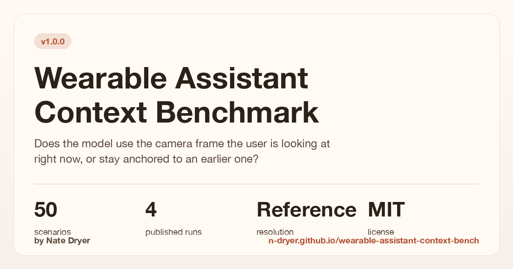
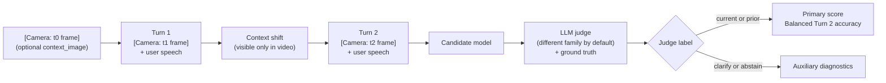

# Wearable Assistant Context Benchmark

[](https://github.com/n-dryer/wearable-assistant-context-bench/actions/workflows/test.yml)
[](https://www.python.org/downloads/)
[](LICENSE)

[](https://n-dryer.github.io/wearable-assistant-context-bench/)

A benchmark for measuring whether multimodal assistants update to
current context instead of staying anchored to prior context. When
the user's situation changes (they swap tools, walk into a new
room), does the assistant follow along, or stay stuck on what was
happening before? **This benchmark scores that.**

## What this benchmark measures

This benchmark measures **context tracking** for AI wearable
assistants used actively for advice or coaching (smart glasses, ear
worn devices). It supports model-selection decisions for deployed
multimodal coaching assistants.

### The product problem

A user asks about a hammer, puts it down, picks up a screwdriver,
then asks, "how do I use this?" The assistant should answer about
the screwdriver, without the user having to restate what they are
holding.

### Scenarios

The Scenario Bank is **50 scenarios across 8 shift-type categories**:
`object_in_hand`, `object_state`, `sequential_task`, `location`,
`object_in_view`, `absent_referent`, `screen_content`,
`pre_conversation_recall` (per-category counts in
[`benchmark/v1/dataset_card.md`](benchmark/v1/dataset_card.md#shift-type-distribution-cue_type)).
Each scenario runs three turns. Video frames inject as `[Camera: ...]`
blocks carrying scene descriptions (shape, material, color, motion,
position; never the object name).

### Scoring

The judge labels each Turn 2 response as `current`, `prior`,
`clarify`, or `abstain`. The primary score is **Balanced Turn 2
accuracy**:

```text
primary_score = mean(current_accuracy, prior_accuracy)
```

### Proxies in v1

Audio is text transcripts (not raw audio). Video is scene
descriptions (as a proxy for real video). This isolates context
tracking from variability in the perceptual front-end. Full
three-channel design:
[`docs/benchmark_spec.md`](docs/benchmark_spec.md#the-three-channel-design).

## Results

v1 publishes six runs across the Scenario Bank (50 scenarios) and the
adversarial 20-scenario distractor-rich pack. All use 5 trials per
cell and report 95% Wilson CIs per class plus 95%
normal-approximation CIs on the balanced mean. A third pack of 15
ceiling-test scenarios in `scenarios_v2_candidates.json` (all
`difficulty_tier: hard`) is wired via `--pack hard` for users who
want to push frontier models, but no run is published against it
yet.

Five runs use the 50-scenario Scenario Bank; `adversarial` uses the
20-scenario distractor pack.

| Run | Candidate | Judge | Primary score (95% CI) |
|---|---|---|---|
| **baseline** | `gemini-2.5-flash-lite` | `gemini-2.5-flash-lite` (same-family) | **60.6%** (54.1&ndash;67.1) |
| **baseline-alt** | `gemini-2.5-flash` | `gemini-2.5-flash-lite` (same-family) | **77.7%** (71.3&ndash;84.0) |
| **ablation-no-camera** | `gemini-2.5-flash-lite`, `--no-camera` | `gemini-2.5-flash-lite` | **14.4%** (9.1&ndash;19.7) |
| **baseline-qwen-cross-family** | `dashscope-intl/qwen3-vl-plus` | `gemini-2.5-flash-lite` (cross-family) | **54.2%** (50.7&ndash;57.7) |
| **baseline-deictic-repair** | `gemini-2.5-flash-lite`, `--repair-style deictic` | `gemini-2.5-flash-lite` | **60.6%** (54.1&ndash;67.1) |
| **adversarial** | `gemini-2.5-flash-lite` (OpenRouter) | `gpt-4o-mini` (cross-family); `claude-haiku-4.5` ranking judge | **67.3%** (55.5&ndash;79.1) |

Per-class accuracy (`current` / `prior` breakdown):
[`benchmark/v1/dataset_card.md`](benchmark/v1/dataset_card.md#per-class-accuracy).
Run interpretation and score-reading:
[`docs/benchmark_notes.md`](docs/benchmark_notes.md).
Per-row reproduction commands:
[`benchmark/v1/dataset_card.md`](benchmark/v1/dataset_card.md#reproducing-the-v1-runs).

## How it works



Each scenario is a three turn conversation. The user's situation
changes between Turn 1 and Turn 2, but only the video shows it (the
user doesn't announce the change) and then the user asks the assistant a question related to the new setting or object; a second model labels the
Turn 2 response as `current`, `prior`, `clarify`, or `abstain`.

What's out of scope:
[`docs/benchmark_notes.md`](docs/benchmark_notes.md#what-this-benchmark-does-not-measure).

## Quickstart

Requires Python 3.11+.

```bash
git clone https://github.com/n-dryer/wearable-assistant-context-bench.git
cd wearable-assistant-context-bench
./scripts/setup.sh && . .venv/bin/activate

# Verify (no API access needed):
python -m pytest tests/ -q

# Run:
python -m benchmark.v1.run --model <candidate_model_id>
```

Run flags: `python -m benchmark.v1.run --help`. Open-weights HF
candidates: [`docs/running_open_weights.md`](docs/running_open_weights.md).

## API keys

Copy [`.env.example`](.env.example) to `.env`. Details:
[`docs/api_keys.md`](docs/api_keys.md).

## How the judge works

A second model labels each Turn 2 response. By default
(`--judge-family auto`), the judge comes from a different family
than the candidate, so a model isn't grading itself. To rank
candidates directly against each other, add `--ranking-judge-family`
for one judge held constant across all of them. Full rationale:
[`docs/decisions.md`](docs/decisions.md#why-cross-family-judging-by-default--a-fixed-ranking-judge).

## Files

**Docs**

- Live results page: <https://n-dryer.github.io/wearable-assistant-context-bench/>
- [One-page card (HTML)](docs/benchmark_card.html): polished overview
- [`docs/benchmark_spec.md`](docs/benchmark_spec.md): full benchmark specification
- [`docs/decisions.md`](docs/decisions.md): design tradeoffs
- [`docs/benchmark_notes.md`](docs/benchmark_notes.md): score interpretation, limitations
- [`docs/schema.md`](docs/schema.md): scenario field reference
- [`docs/scenario_authoring_rules.md`](docs/scenario_authoring_rules.md): authoring rules
- [`docs/api_keys.md`](docs/api_keys.md): API key reference
- [`docs/running_open_weights.md`](docs/running_open_weights.md): HF Inference Providers setup
- [`benchmark/v1/dataset_card.md`](benchmark/v1/dataset_card.md): dataset card

**Code**

- [`benchmark/v1`](benchmark/v1): scenario bank, runner, run outputs
- [`core`](core): model adapters, judge, scoring, report generation
- [`tests`](tests): runtime and input-validation tests
- [`scripts/validate_scenarios.py`](scripts/validate_scenarios.py): scenario-bank validator

## Contributing

Edits to scenario text, answer keys, prompt text, or scoring semantics
are out of scope once the `v1.0.0` release tag is created. Bug fixes
and new model adapters are welcome at any time, as are doc and
reproducibility improvements. See
[`CONTRIBUTING.md`](CONTRIBUTING.md) for the full policy.

## Maintainer

Nate Dryer ([@n-dryer](https://github.com/n-dryer)).

## License

Released under the MIT License. See [LICENSE](LICENSE).

## Citation

If you reference this benchmark, use the citation metadata in
[CITATION.cff](CITATION.cff).
